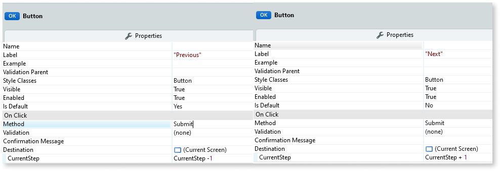
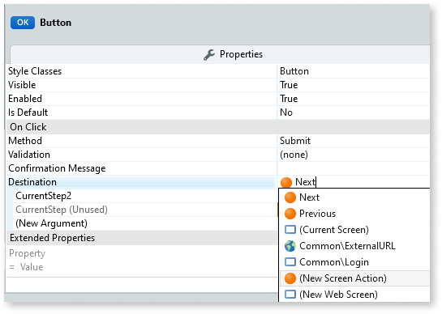
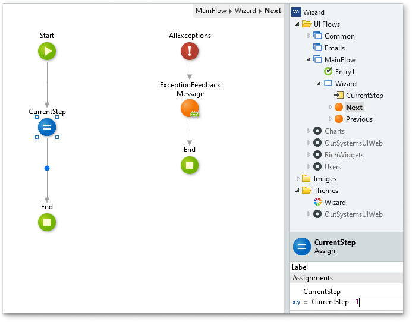

# Wizard UI Pattern

**_Note:_**  _Applicable to Traditional Web Apps Only_.

You can use the Wizard UI pattern to split large complex tasks and processes into smaller manageable steps. Wizards usually include explicit button navigation to move a step forward or backward. 

**How to Use the Wizard UI Pattern**

1. In Service Studio, select the **Interface** tab.
1. On the left side of the screen, in the **Search** field, enter **Wizard**. 
    
    The Wizard block is displayed. 

     

1. From the Toolbox, drag the Wizard block onto your application's screen.

    By default the Wizard block contains three Wizard Item blocks. Each Wizard Item represents a step. You can add or delete Wizard Items as required.

    

**Create a Wizard with Navigation Buttons**

The following example demonstrates how you can create a three step Wizard with navigation buttons.

1. Rename each of the Wizard Items to Shopping Details, Payment Details, and Review Order respectively.

    

1. Create an Input Parameter with the following properties:
    
    
 
    This input paramenter controls the current Wizard step. 
    Setting the Default Value to 1 ensures the Wizard always starts at step 1.

1. From the Toolbox, drag two Button widgets onto your screen and set their names to **Previous** and **Next**.

1. Define the behaviour for each of the navigation buttons. 

    

1. Create an expression that defines the status of each of the Wizard Items (current step, already completed, yet to be completed), depending on what stage the user is at.

    

1. Create a condition for both the Previous and Next buttons to enusre the Wizard never goes below nor above the actual number of steps.

    

**Add Content to your Wizard**

1. Create a condition to control what is displayed, depending on what step is active.

    

1. Add the relevant content to each for each of the steps.

     The following example shows the Shipping Details step that contains text and input boxes.

    

1. Create variables for each of the elements in the step container. 
    

    

**Create a Screen Action**

To ensure that all of the inforamtion the user enters is passed from step to step, you must create a screen action for the Previous and Next navigation buttons.

1. Select the Previous button.
1. In Properties, from the Destination drop-down, select (New Screen Action).

    

1. From the Toolbox, drag the Assign block onto your screen and set the properties so that the user inputs get passed from step to step.

    

1. Repeat these steps for the Previous button.

After following all of the steps in each of the sections, you can publish the module, you can test the Wizard in your app.

## Properties

### Wizard

| **Property** |  **Description** |  **Usage** | 
|---|---|---|
| Orientation (Orientation Identifier): Optional  |  Set the orientation. |
| ExtendedClass (Text): Optional  |  Add custom style classes to the block. | 

### Wizard Item

| **Property** |  **Description** |  **Usage** | 
|---|---|---|
| Step (Step Identifier): Mandatory | Set the step. |
| UseTopLabel (Boolean): Optional  |  If True, label is placed above the icon. | 
| ExtendedClass (Text): Optional |  Add custom style classes to the block. | 
  

## See Also

* OutSystems UI Live Style Guide: [Wizard](https://outsystemsui.outsystems.com/WebStyleGuidePreview/Wizard.aspx)
* OutSystems UI Pattern Page: [Wizard](https://outsystemsui.outsystems.com/OutSystemsUIWebsite/PatternDetail?PatternId=82)

